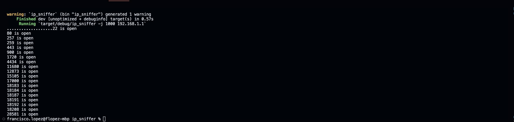

## Network Sniffer

We want to check open ports in a specific IP address. We need to specify the IP address and per port open we'll have a thread monitoring traffic

Please type
```
cargo run -j 1000 192.168.1.1
```

if you want to check open ports at adress `192.168.1.1` with 1000 threads.

By default, the number of threads is `4`. In case you don't want to specify a specific number of threads just run

```
cargo run 192.168.1.1

```


If you need help, please run:

```
cargo run -h
```


